# Manual de Usuario de la Aplicación

## Índice
1. [Introducción](#introducción)
2. [Registro e inicio de sesión](#1-registro-e-inicio-de-sesión)
3. [Pantalla principal](#2-pantalla-principal)
4. [Quiz interactivo](#3-quiz-interactivo)
5. [Chat](#4-chat)
6. [Perfil de niños](#5-perfil-de-niños)
7. [Perfil de padres](#6-perfil-de-padres)
8. [Perfil de animadores](#7-perfil-de-animadores)

## Introducción

Este proyecto forma parte de mi trabajo de fin de grado, este se centra en el desarrollo de una aplicación móvil para la asociación juvenil MAJO, afiliada a las Salesianas de Las Palmas de Gran Canaria. Su propósito es mejorar la organización de la labor de los animadores dentro de la asociación y mantener a los padres y niños informados sobre las últimas novedades. Además de estas funciones principales, la aplicación incluye otras características como un quiz interactivo para actividades educativas y un chat que facilita la comunicación directa de los animadores con padres y niños. Estos elementos no solo enriquecen la experiencia de usuario, sino que también promueven una mayor participación e interacción dentro de la comunidad de la asociación.

En este README se describen las distintas funcionalidades que se pueden realizar en la aplicación.
  
Para comenzar a utilizar la aplicación en un smartphone con sistema operativo Android, una vez descargado el archivo APK, se deberá proceder con su instalación ejecutando el archivo. Es posible que en la primera ejecución aparezca un aviso indicando que el desarrollador no está identificado o que el origen es desconocido, dependiendo del dispositivo. En este caso, se deberá permitir la instalación desde fuentes desconocidas en la configuración del dispositivo.
  
Una vez instalada, el usuario podrá acceder a la aplicación y disfrutar de todas sus funcionalidades. El manual de usuario proporcionará una guía detallada sobre el uso de todas estas funcionalidades, para que el usuario pueda sacar el máximo provecho de la aplicación y disfrutar de una experiencia enriquecedora.

## 1. Registro e inicio de sesión

En primer lugar, al abrir la aplicación, el usuario verá la pantalla para usuarios no autenticados.  Desde esta pantalla, podrá iniciar sesión en caso de disponer de una cuenta, o registrarse en caso contrario.

Para iniciar sesión, se le pedirá al usuario introducir su DNI y contraseña. Sin embargo, la pantalla de registro esta creada a modo de inscripción en la asociación, son los padres quienes deben inscribir a sus respectivos hijos en la aplicación, para ello se les solicitará información importante sobre el niño a inscribir y sobre ellos.

Ademas, es importante señalar, que antes de poder acceder a la pantalla de registro, se deben aceptar los términos y condiciones de uso de la aplicación, en caso de no aceptar se devolverá al usuario a la pagina de inicio de sesion.

  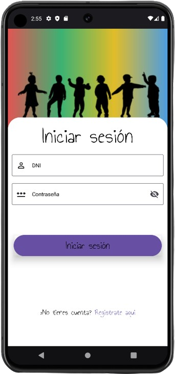
  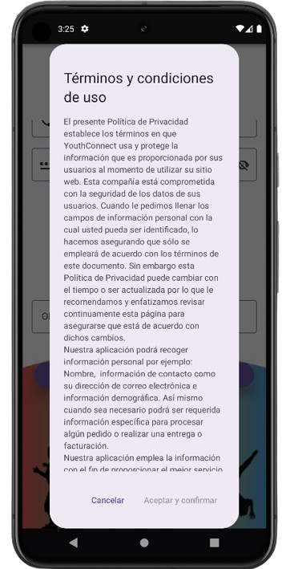

Los campos a rellenar son tales como, DNI del niño, contraseña para la cuenta del menor, DNI del padre y contraseña para la cuenta del mismo. Por otro lado, se pedira información relevante para la asociación, como el deseo de inscribir al niño en los grupos de fe, observaciones importantes, si pertenece al centro escolar o no, o si tiene permitido salir solo del centro. 

  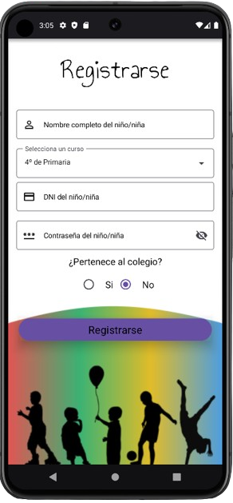
  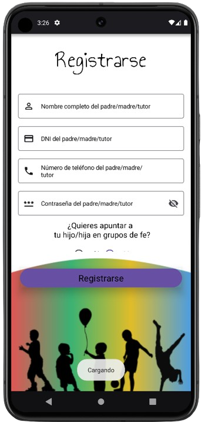
  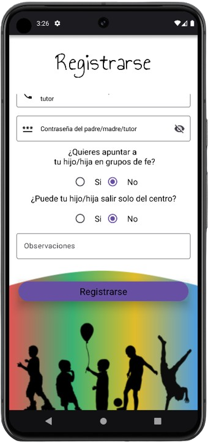

Una vez que el usuario haya iniciado sesión o se haya registrado correctamente, será redirigido a la pantalla principal de la aplicación.

## 2. Pantalla principal
Cuando el usuario se autentica, se pueden diferenciar tres partes de la pantalla, de arriba hacia abajo: el horario de la asociación, un apartado de últimas noticias en el que estar al corriente de las últimas novedades de la asociación y una barra inferior de navegación.
Cada una de las noticias se pueda abrir para obtener mas información pulsando sobre ella.

  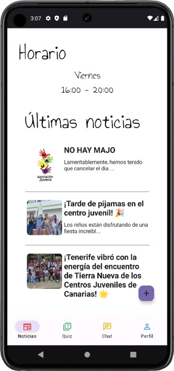
  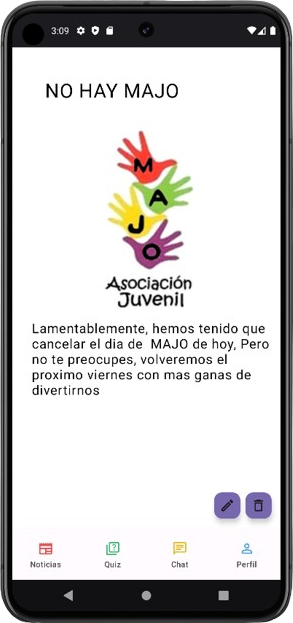

La barra de navegación tiene cuatro iconos, de izquierda a derecha: la pantalla principal, el quiz interactivo, el chat entre usuarios, y el perfil del usuario. La pantalla que está viendo el usuario se muestra con un pequeño sombreado de color gris, mientras que las demás se mantienen de color blanco.

Si al autenticarse el usuario tiene el rol de animador, encontrará un botón violeta en la parte inferior derecha de la pantalla principal, desde el cual se pueden agregar noticias.

De manera similar, en la pantalla de detalles de las noticias, estarán disponibles dos botones adicionales: editar y eliminar.

Tanto al añadir una noticia como al editarla, se abrirá un overlay en el cual se deberá introducir el título, la descripción de la noticia y una fotografía. En el caso de agregar una noticia nueva, se ofrecerá la opción de enviar una notificación a los usuarios. En el caso de editar una noticia existente, este overlay cargará automáticamente los datos previamente introducidos a excepción de la imagen que no es editable.

  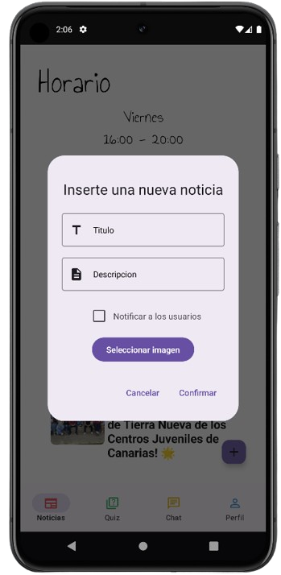
  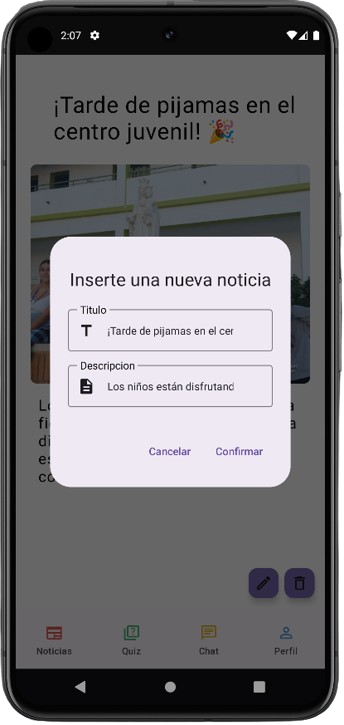

## 3. Quiz interactivo

Cuando un usuario registrado accede al quiz interactivo a través de la barra de navegación inferior, identificada con un icono de preguntas, dicho icono se sombrea en un tono grisáceo.

En esta pantalla, si el usuario ha iniciado sesión como animador, se mostrará una lista con todas las preguntas disponibles en la aplicación. De esta manera, el usuario podrá editar las preguntas al pulsar sobre cada una de ellas, añadir nuevas preguntas pulsando el botón violeta ubicado en la esquina inferior derecha, o eliminarlas pulsando el icono de papelera disponible en cada pregunta.

Al igual que con las noticias, al editar o añadir nuevas preguntas, aparecerá un overlay en el cual se deberá introducir la pregunta deseada junto con sus cuatro posibles respuestas. Es importante mencionar que si no se selecciona la respuesta correcta mediante el checkbox situado a la izquierda de cada posible respuesta, esta no se añadirá al repositorio de preguntas.

  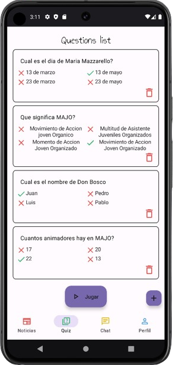
  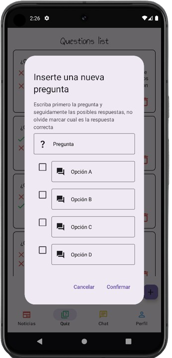
  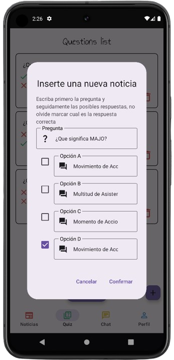

Finalmente, en la parte inferior de la pantalla se encuentra el botón Jugar. Al pulsarlo, se accede a una pantalla dividida en dos secciones: una con la pregunta a responder y otra con las cuatro posibles respuestas, presentadas en botones de colores que corresponden con las tonalidades de la aplicación.

Al seleccionar uno de estos botones, la aplicación cargará automáticamente la siguiente pregunta hasta agotar el repositorio de preguntas. Una vez finalizado el quiz, se mostrará una pantalla con la puntuación obtenida y un mensaje que variará según la puntuación lograda. Además, habrá un botón de Reiniciar que, al pulsarlo, redirigirá a la pantalla del repositorio de preguntas.

Sin embargo, si el usuario se autentica como padre o niño, al pulsar el botón de quiz en el menú de navegación, accederá directamente al propio juego.

  
  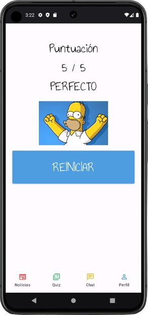

## 4. Chat
Cuando un usuario registrado accede al chat a través de la barra de navegación inferior, identificada con un icono de mensaje, dicho icono se sombrea en un tono grisáceo.

En esta sección, el usuario podrá ver una barra de búsqueda donde puede buscar a cualquier usuario disponible por su nombre de usuario. A continuación, se muestra una lista con todos los usuarios a los que el usuario autenticado tiene permiso para contactar. Estos usuarios se presentan con la foto de perfil que cada uno ha elegido y su nombre.

Para evitar confusiones, si tienes el rol de animador, al lado de cada foto de perfil aparecerá un icono indicando el rol de cada usuario. Los mensajes nuevos en cada conversación serán señalados con un icono rojo de mensajes ubicado entre la foto de perfil y el nombre del usuario.

Al seleccionar a uno de los usuarios, la aplicación redirigirá a una pantalla donde se podrá ver la foto y el nombre del usuario con el que se está conversando, así como todos los mensajes intercambiados previamente. Los mensajes enviados por el receptor se situarán a la izquierda y en color rojo, mientras que los mensajes enviados por el usuario autenticado se situarán a la derecha y en color azul.

Finalmente, en la parte inferior de la pantalla, se puede observar un cuadro de texto donde escribir nuevos mensajes, los cuales se envían mediante el icono situado a la derecha del mismo.

  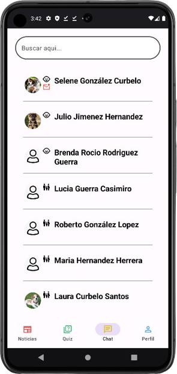
  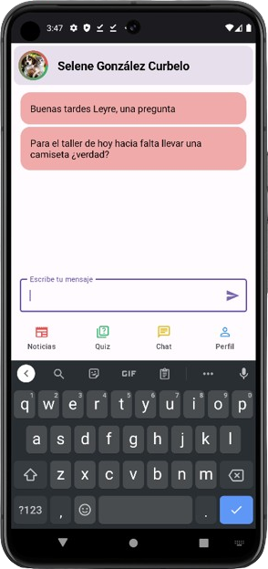

## 5. Perfil de niños
Al estar autenticado como niño y pulsar en el botón de perfil en la barra de navegación, se muestra la pantalla de perfil del usuario en cuestión.

En primer lugar, se puede observar la foto de perfil elegida por el usuario. Al pulsar sobre ella, se abre un cuadro de diálogo que permite seleccionar el origen de la nueva imagen, ya sea desde la galería o desde la propia cámara. Además, esta imagen estará rodeada de un margen verde si el usuario tiene permiso para salir solo del centro, o rojo si no tiene permitido salir.

Debajo de la imagen, se encuentra el nombre completo del usuario. A la derecha del mismo, se puede observar un icono que indica su estado: una casa si está dentro del centro o un árbol si está fuera del centro.

A continuación, se presenta información relevante del usuario, como el curso académico al que pertenece y el boton Salir el cual permite cerrar la sesión del usuario.

Además, se muestra un listado con el nombre de sus padres o tutores legales y un teléfono de contacto para emergencias.

Finalmente, se puede ver el código QR asociado al usuario. Al escanearlo dentro de la aplicación, se cambia el estado del usuario.

Cabe destacar que, si estás autenticado como animador y entras en el perfil de un niño, podrás editar sus datos pulsando el botón editar que se encuentra al lado del nombre. Además, se podrá ver la lista de asistencia a los Grupos de Fe pulsando el botón en la parte inferior de la pantalla.

  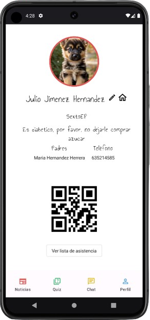

## 6. Perfil de padres

Al autenticarse como padre y pulsar en el botón de perfil en la barra de navegación, se muestra la pantalla de perfil del usuario correspondiente.

En primer lugar, al igual que en el perfil de usuario de los niños, se muestra la imagen de perfil seleccionada por el usuario autenticado. Al pulsar sobre esta, el usuario puede decidir si desea modificarla utilizando la cámara o la galería de imágenes.

A continuación, se muestra el nombre completo del usuario, el boton Salir para cerrar la sesión del usuario y una lista con los nombres de sus hijos. Al pulsar en cada uno de ellos, la aplicación redirige al perfil del niño seleccionado.

Es importante destacar que, si se está autenticado como animador y se accede al perfil de un padre, se puede editar la información del padre pulsando el botón editar que se encuentra junto al nombre.

  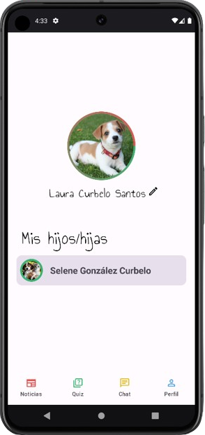

## 7. Perfil de animadores

Al autenticarse como animador y pulsar en el botón de perfil en la barra de navegación se muestra la pantalla de perfil del usuario correspondiente.

En primer lugar al igual que en el resto de perfiles de usuario se muestra la imagen de perfil seleccionada por el usuario autenticado Al pulsar sobre esta el usuario puede decidir si desea modificarla utilizando la cámara o la galería de imágenes

A continuación se muestra el nombre completo del animador junto a un icono de edición el cual permite al usuario cambiar sus datos y el botón de Salir el cual permite cerrar la sesión en el dispositivo

Además cada animador puede encontrar en su perfil una lista con los usuarios que previamente le han sido asignados y señalar si ese día han asistido a los grupos de fe o no

Es importante señalar que en la esquina superior izquierda podemos encontrar un botón con el icono de Añadir usuario el cual permite registrar nuevos animadores en la aplicación. Al pulsar este botón se abrirá un overlay en el cual se requerirá el nombre del animador el DNI y la contraseña de su perfil.

  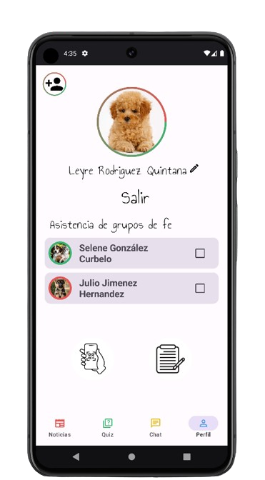
  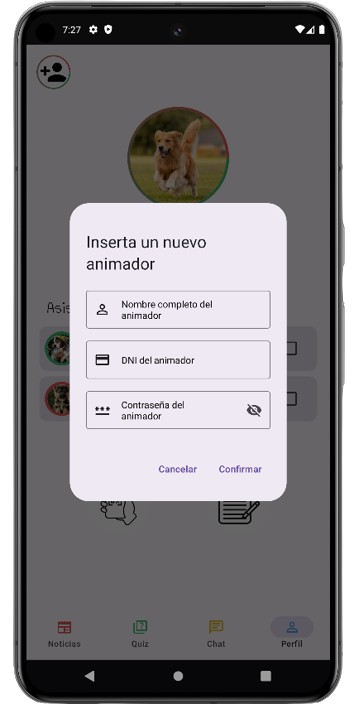

Por otro lado, nos encontramos con dos botones en la parte inferior: el escáner de códigos QR y la lista de niños inscritos en la asociación.

Al pulsar el botón para escanear el código QR aparecerá un diálogo en el cual se le debe conceder permisos a la cámara para poder ser utilizada dentro de la aplicación. Una vez abierta la cámara si el escáner detecta un código QR válido será redirigido automáticamente al perfil del usuario del niño.

Sin embargo al pulsar el botón de la lista de niños se abre una pantalla con un buscador y un listado con todos los niños inscritos en la asociación, estos aparecen con su foto de perfil y el nombre completo. Al pulsar sobre ellos la aplicación redirige hacia su perfil de usuario. Si se pulsa en el botón desplegable que se encuentra a la derecha se puede asignar un animador a cada niño así como visualizar otros datos importantes tales como si está apuntado en grupos de fe o si pertenece al colegio.

  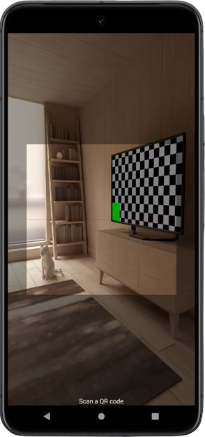
  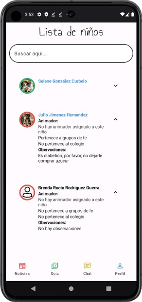

## Collaborators
- [Leyre](https://github.com/LeyreRodriguez)
---

No dude en explorar las funcionalidades y el diseño de la aplicación. Si tiene alguna pregunta o sugerencia, no dude en ponerse en contacto con los colaboradores. Su apoyo y compromiso son cruciales para que la aplicación YouthConnect sea un éxito.
